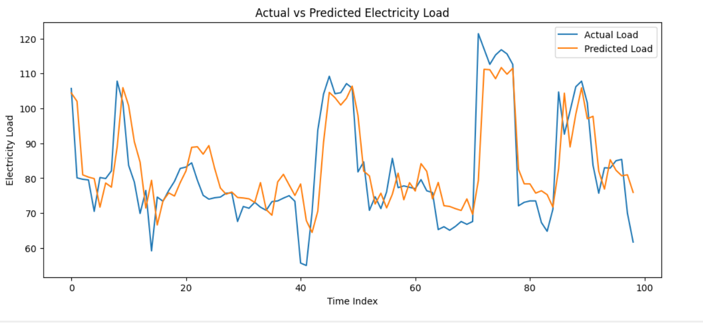
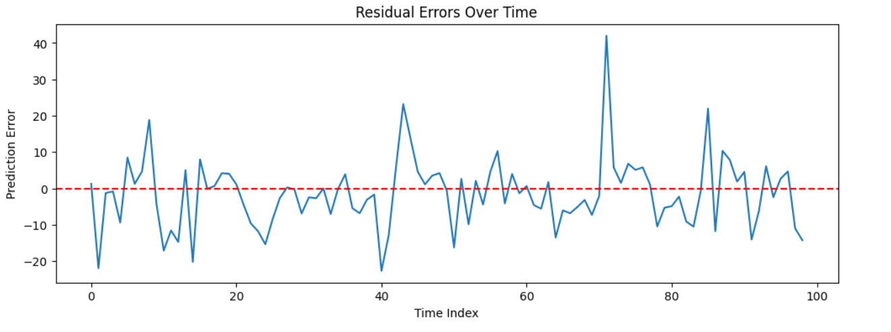
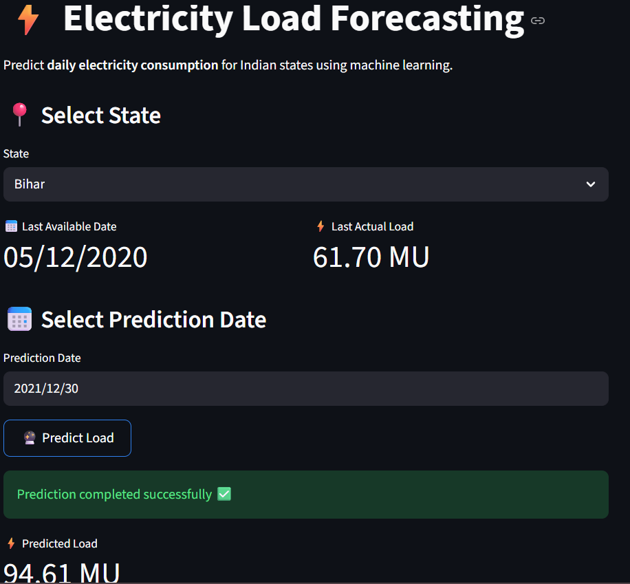

# ⚡ Electricity Load Forecasting using Machine Learning

---

## 📌 Project Overview

This project focuses on forecasting future electricity demand for a selected
Indian state using historical power consumption data and multiple machine
learning regression models. The objective is to analyze electricity usage
patterns, compare different machine learning models, and deploy the best
performing model using a web-based application.

The project demonstrates a complete **end-to-end machine learning pipeline**,
starting from raw data preprocessing to model deployment, making it suitable
for **B.Tech final year evaluation**, internships, and portfolio use.

---

## 🎯 Project Objectives

• Forecast next-day electricity load using historical time-series data  
• Perform comparative analysis of multiple machine learning models  
• Select the best model based on error metrics  
• Deploy the trained model using a Streamlit web application  

---

## 📊 Dataset Description

• **Source:** Kaggle – State-wise Power Consumption in India  
• **Type:** Time-series electricity consumption dataset  
• **Scope:** Single-state electricity load forecasting  
• **Granularity:** Daily electricity consumption  

The original dataset contains electricity consumption values for multiple
Indian states. For this project, a single state was selected and extracted
to form a **univariate time-series forecasting problem**.

---

## 🤖 Machine Learning Models Used

The following regression models were trained and evaluated:

• Linear Regression (baseline model)  
• Random Forest Regressor  
• Gradient Boosting Regressor  
• Support Vector Regressor (SVR)  

Training multiple models allows fair comparison and helps in identifying
the most accurate approach for electricity load forecasting.

---

## 🛠 Feature Engineering

To capture temporal dependencies, trends, and seasonality, the following
features were engineered:

• Lag features (previous day load, previous week load)  
• Rolling mean feature (7-day moving average)  
• Calendar-based features  
  - Day of month  
  - Month  
  - Day of week  

These features significantly improve model performance in time-series
forecasting tasks.

---

## 📈 Model Evaluation Metrics

The models were evaluated using standard regression metrics:

• Mean Absolute Error (MAE)  
• Root Mean Square Error (RMSE)  
• R² Score  

The model with the **lowest RMSE** was selected as the final forecasting model,
as RMSE penalizes large prediction errors and is well-suited for load
forecasting problems.

---

## 💾 Model Selection and Saving

After evaluation, the best-performing model was retrained and saved for
future predictions. The trained model was serialized and reused for making
new electricity load predictions without retraining.

---

## 🌐 Streamlit Web Application

A lightweight Streamlit web application was developed to demonstrate
**next-day electricity load prediction** using the trained machine learning
model. The application loads the saved model, prepares the most recent
feature values, and displays the predicted electricity load in a clean and
user-friendly interface.

---

## 🚀 Live Deployment

The Streamlit application is deployed and publicly accessible at:

🔗 **https://electricity-load-forecasting-amitx2209.streamlit.app**

(This link can be shared for viva, demonstrations, and evaluations.)

---

## ▶️ How to Run the Application Locally

From the project root directory, run:

python -m streamlit run app.py

The application will automatically open in a web browser.

---

## 📷 Project Screenshots

### 📊 Actual vs Predicted Electricity Load

### 📉 Residual Error Plot

### 🌐 Streamlit Web Application

---

## 🧰 Tools and Technologies

• Python  
• Pandas and NumPy  
• Scikit-learn  
• Jupyter Notebook  
• Streamlit  
• Git and GitHub  

---

## ✅ Conclusion

This project demonstrates the effective application of machine learning
techniques for electricity load forecasting. By comparing multiple
regression models and deploying the best-performing model through a web
application, the project highlights the practical relevance of machine
learning in energy demand prediction and power management systems.

---

## 👤 Author

**Amit Kumar**  

